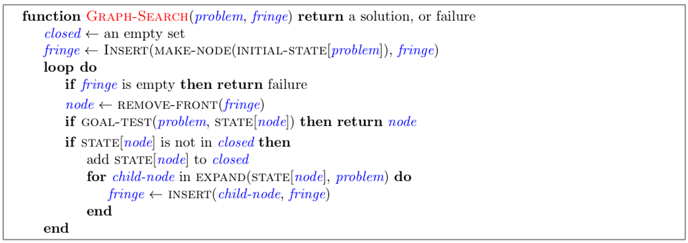
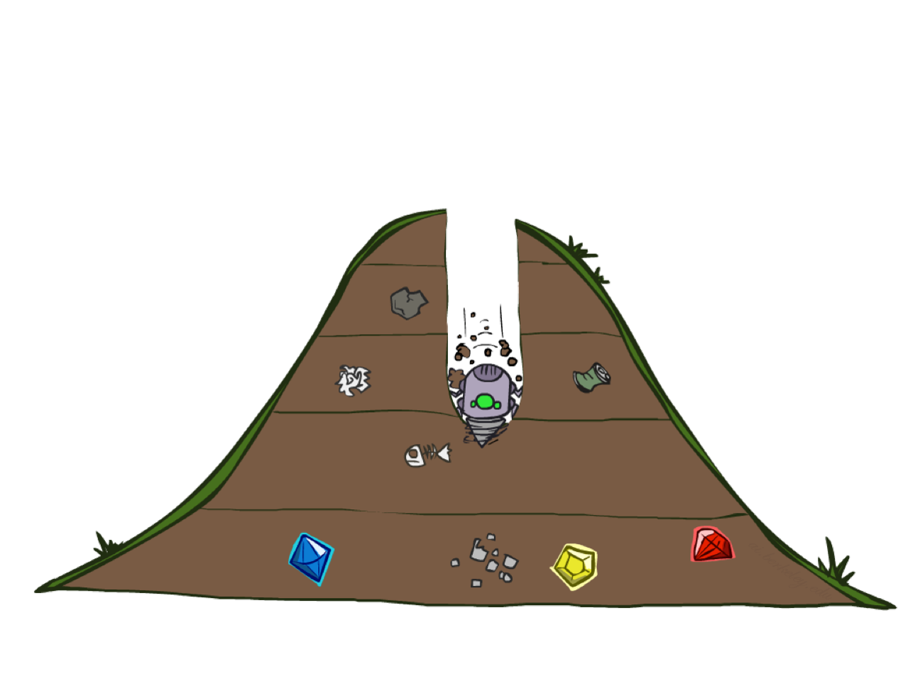
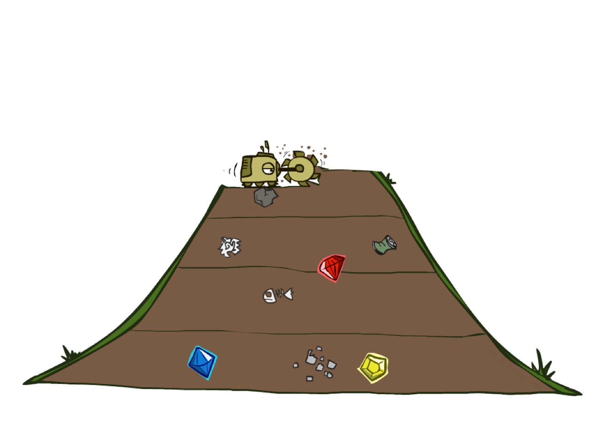
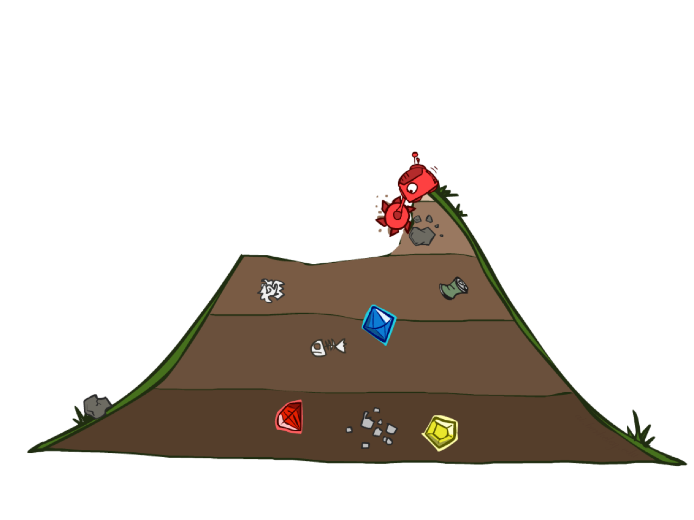
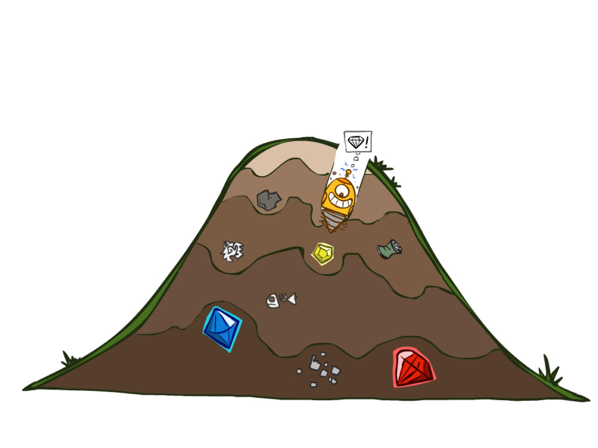
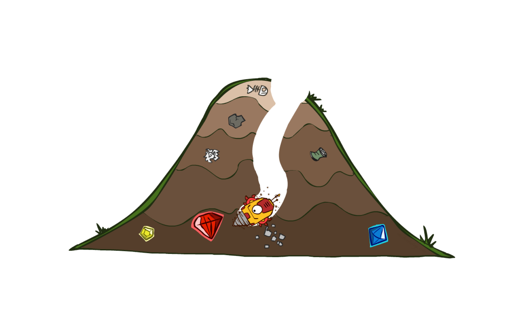

# 一些浅显的笔记
## P0 prepare environment
### Creating a Conda Environment
```shell
conda create --name cs188 python=3.6
```
### Entering the Environment
```shell
conda activate cs188
```
## P1 Search
### Graph Search Pseudo-Code

### DFS(Depth-First Search)
Time saving(maybe);  &nbsp;Non-optimal solution  
实现思路：按照last-in-first-out(LIFO)的stack容器规则顺序pop出所需的node，然后对node进行判断，如果该node是target node,那么我就记录（返回）到达该node的path  
优点：速度相对较快  
缺点：我最终得到的path不一定是最短路径  
感想：在该课程中，其实基本框架已经搭好，比如说   
- stack容器，
- 判断是否为target node，
- A successor function（这里我的理解是获得我下一步有哪些node可以到达，即两个信息，一是node的位置坐标（state），二是我到达的方式，一般是位移方向，这里指的是东西南北）  
  
  


### BFS(Breadth-First Search)

Time Long;   &nbsp;optimal solution  
实现思路：思想与dfs一样，不一样的是采用了queue(FIFO)的数据结构  
优点：可以得到最短路径  
缺点：耗时长
感想：同样queue数据结构等已经被构造好了，我们只要调用就好




### UCS(Uniform Cost Search)
optimized form BFS    
UCS是BFS的优化版，即我考虑了到达下一个节点的代价（cost）,我会优先选取cost最小的node  
实现思路：没啥实现思路，cs188已经把PriorityQueue这个class数据结构写好的，我们只需要调用就好了（ps：不是自己写的，感觉还是不太踏实）  
优点：与BFS相比不再是简单的找到target目标，而是将问题更加实际化考虑了行动成本  
缺点：还是慢


---
下面是**Search Heuristics（启发式搜索）**  
A heuristic is:  
A function that estimates how close a state is to a goal    
- Designed for a particular search problem
- Examples: Manhattan distance, Euclidean distance for pathing  

在这之前的找豆豆的search都是胡乱找，查找豆豆的思想是遍历，这无疑是一种不聪明的做法。既然我们知道目标的坐标，可以对这个坐标加以利用。   
当然，当我们不知道目标的具体位置时，即在检测时才能判断是否为目标（检测条件可以时颜色等可识别消息），我们就无法采用启发式搜索。  
通俗来讲，启发式搜索需要需要了解目标的绝对坐标或相对坐标 target node，大概就是我在遍历某组节点时需要判断该node到target node之间的距离，然后取一个距离最短的node
（理解不深，可能有误）
### Greedy Search
Strategy: expand a node that you think is closest to a goal state。   
这里只学了大概方法，没写具体实现。    
Worst-case: like a badly-guided DFS。  
A common case: 
Best-first takes you straight to the (wrong) goal。   
Heuristic: estimate of distance to nearest goal for each state


### A\* Search
Combining UCS and Greedy  


A\* 函数接口为 **def aStarSearch(problem, heuristic=nullHeuristic):**  
该算法功能并不局限于简单的查找，所谓简单的查找，即上述我们使用DFS、BFS、UCS方法解决的问题：Finding a Fixed Food Dot。这种问题我们只需要知道food dot的坐标，拥有探查可走的路的传感器，就可以通过算法来实现查找。  

下面，我们引入一个新的search问题:corner problem。  
Our new search problem is to find the shortest path through the maze that touches all four corners。 

对于这个问题，A \* 算法更具优势。

## P2 Multi-Agent Search
### Reflex Agent
### Minimax
### Alpha-Beta Pruning
### Expectimax Search
## P3 Reinforcement Learning
强化学习  
*生活中很多都是**unexpected***  
*因此我们采用概率表达状态发生的可能性*  
**MDPs(Markov Decision Processes)**  
    &nbsp; MDPs are non-deterministic search problems  
- One way to solve them is with expectimax search  
- We’ll have a new tool soon
  
### Value Iteration
迭代（循环）   
计算所有的值，并取最好的（求MAX）

Q value？
### Bridge Crossing Analysis
过桥问题  
令noise=0，不会掉落
### Policies
策略迭代与值迭代都是计算Q值，都是动态解决MDP问题的方法    
不断生成更好的策略
### Asynchronous Value Iteration
异步值迭代是策略迭代算法的核心   
一次更新一个状态，计算量较小
### Prioritized Sweeping Value Iteration
策略迭代的优化  


